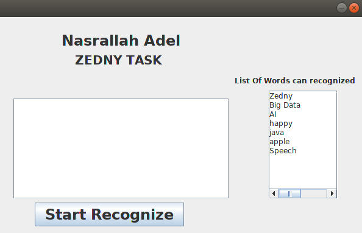
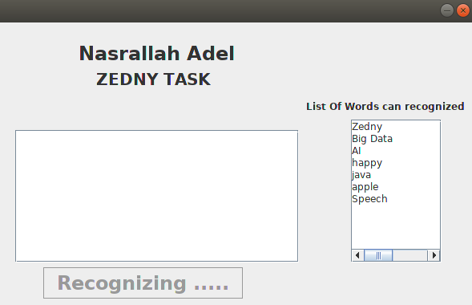
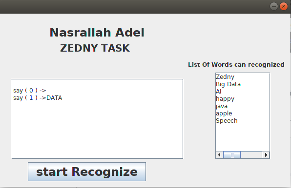

# CMUSphinx_demo
#### LIB ->>> [sphinx4 LIBERARY](https://github.com/cmusphinx/sphinx4) :+1:
#### TOOL To Generate .dic and .lm ->>> [LMtool](http://www.speech.cs.cmu.edu/tools/lmtool-new.html) :+1:
### LIST OF WORD THIS DEMO CAN RECOGNIZE :-

1- Zedny
2- Big Data
3- AI
4- happy
5- java
6- apple
7- Speech

## Screenshots

